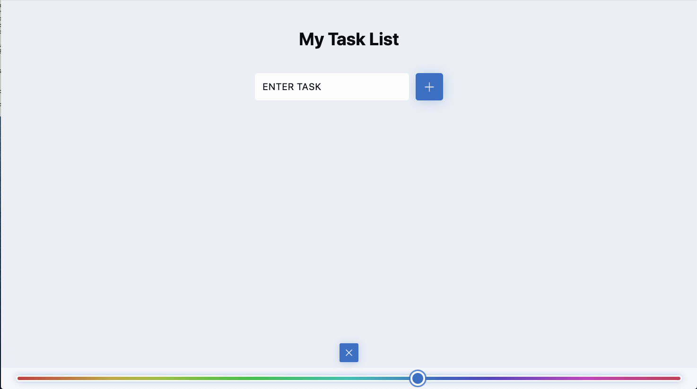

# ToDo-App-React-Vite-DarkMode
ToDo App with created with React and Vite. Features dark mode as well as light mode. Includes a slider to adjust secondary colour.

 
 
<!-- Technologies used -->

 
<h2 align="left">🛠 Languages and Tools:</h2>
 

 

 

 
 <!-- Screenshot -->
   

 
 

   <!-- Online link -->
   
 
<h2 align="left">👀 View online:</h2>
 
<a href="https://deftpegtodothemeswitcher.netlify.app//" target="_blank" rel="noreferrer">
Take me to the website, </a>
or alternately, click on the image 👉

 

 